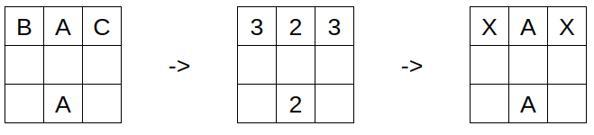
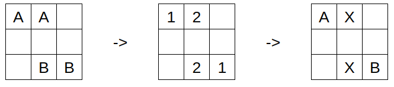

# Rules

## World map

The game is played on a square grid, where every square can have one of three
types:
- Empty
- Water - No ants can move onto this square, but it does not block attacks.
- Hill

Hills function as spawn points for new ants. They are integral to a colony's
survival, so it is important to protect them.

## Game loop

The game is played in turns. The game loop continues until at least one of the
following end conditions is met:
- No more players are alive.
- A single player is alive.
- A turn limit is reached.

Each turn consists of six phases, evaluated one after another in this order:

### Move phase

During this phase, the player's bots are queried for commands for their ants.
If the bot fails to respond within the time limit or terminates during this
time, it is immediately killed.

After commands from all bots are submitted, they are simultaneously executed.
If there are two or more ants on the same square after this, they are all
killed (even if they belong to the same colony).

### Attack phase

For the purposes of attacking, we define a variable `focus_split` for every
ant. This constant is the number of enemy ants within an ant’s attack range. If
any of the ants in this attack range have a lower or equal `focus_split` than
the current ant, the current ant is marked to be killed.

After this is done for all ants, those marked to be killed are simultaneously
removed from the game.

#### Examples

This is a bit confusing, so let’s walk through some examples. The square attack
range of ants in the game is 5, so we will use this number in the examples.



Here, there are three different colonies of ants (A, B, and C) battling.
Because ants of colony A are together, they have a `focus_split` of only 2, and
their enemies have a `focus_split` of 3. Therefore, all ants except those from
colony A will die after the battle phase.



In this example, the outermost ants are not close enough to battle, so their
`focus_split` is only 1. Therefore, all of the ants in the middle will die
after the battle phase.

For further clarity, here is pseudocode for determining the dead ants:
```py
for ant in alive_ants:
    for other_ant in alive_ants:
        if different_teams(ant, other_ant) and in_range(ant, other_ant):
            focus_split[ant] += 1

for ant in alive_ants:
    for other_ant in alive_ants:
        if different_teams(ant, other_ant) and in_range(ant, other_ant):
            if focus_split[ant] >= focus_split[other_ant]:
                mark(ant)
```

### Razing phase

If any ants survived the previous phase on an enemy hill, they then raze this
hill. This means that the hill will no longer be able to spawn new ants.
Additionally, the attacker is awarded some points, and the former owner of the
hill suffers a penalty (see Scoring).

### Ant spawning phase

Every unit of food that is collected is equivalent to one new ant. For each
player, a list of all their hills that do not have an ant on top of them is
created and randomly shuffled. Then, for each unit of food the player has
stored, one ant is spawned on top of a hill.

### Gather phase

Now it is time to gather the resources scattered around the map. If any ant is
in range of a food, it will be marked by its colony. The player collects all
resources that were marked only by their colony. If a food is marked by two or
more colonies, it will be destroyed instead.

### Food spawning phase

Every turn, the number of newly spawned resources is calculated using the
formula `(max_food_count - current_food_count)/2`. Then, that many resources
are spawned on random squares, which are not blocked by water tiles.

## Eliminating players

Players can be eliminated from the game in the following ways:
- Failed to respond with commands (time limit exceeded or the bot crashed).
- No ants left and unable to spawn any more ants (all their hills are razed, or they have no food stored).

After a player is eliminated, they are no longer queried for commands. However,
their living ants and hills stay in play, so they can still lose points if one
of their hills is razed.

## Scoring

Every player starts the game with points equal to the number of hills they
start with. When a hill is razed, the owner loses 1 point, and the attacker
gains 2 points.

The other source of points is outliving other players. When a player is
eliminated, all other living players gain 1 point.

## Implementation details

If you want to create your bot using one of the languages with prepared
templates, you do not need to read any further. The rest of this document
contains communication specifications and other technical details.

---

### Communication

The server communicates with the bot via standard input and output. Every
message ends with a separate line containing only a `.` character.

Input from the server starts with one of two headers: `INIT` or `TURN <num>`.
The first message is always `INIT`, and all subsequent messages are `TURN
<num>`, where `<num>` is the current turn number.

Every message contains several blocks. Each block starts with a header,
followed by the number of lines it contains. A list of all blocks can be seen
in the `C++` template implementation of [comms](./players/cpp/common/comms.cpp)
or in the server implementation of [format](./server/protocol/src/format.cpp).

The client responds with a single message containing all the commands for the
ants. Each command is in the format `<ant_id> <x> <y>`. The message ends with a
`.` character on a separate line.

### Other details

Due to the implementation of process isolation, the bot **must** be able to run
on its own, meaning it cannot rely on any external files or libraries (for
example, when using a `C++` bot, you need to statically link its binary).

This is a problem for interpreted languages like Python. To run a Python bot,
you need to use the `NO_SANDBOX` flag in the player configuration. Note that
this will allow the bot to access the filesystem, so be careful with this.

However, this may be subject to change in the future.
